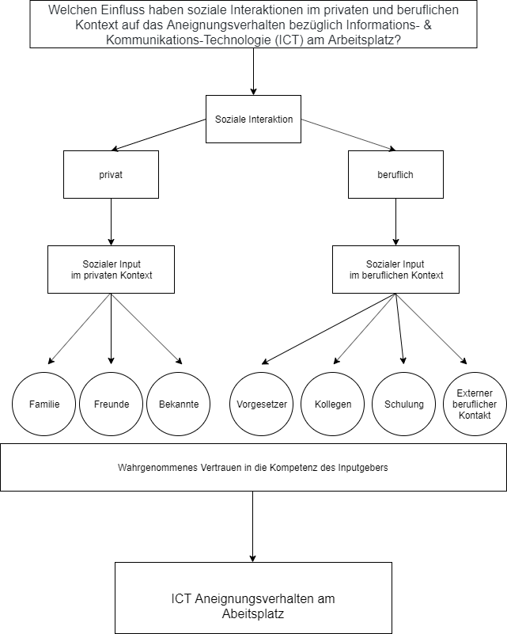

#### ICTamArbeitsplatzWS1920

### Gruppe 1: ICT am Arbeitsplatz

#### Gruppenmitglieder

* Tanita Geiger
* Andrea Wiel
* Julian Freudenhammer
* Julian Massau
* Chanrainsey Roth
* Marie Sommermann

#### Forschungsfrage

Welchen Einfluss haben soziale Interaktionen im privaten und beruflichen Kontext auf das Aneignungsverhalten bezüglich Informations- & Kommunikations-Technologie (ICT) am Arbeitsplatz?

#### Faktorenraum

#### Fragebogenkonstruktion

##### Teil 1: Demographische Daten

* Alter
* Geschlecht
* Bildungsstand
* Berufsfeld

* Welche digitalen Endgeräte werden im Beruf genutzt

##### Teil 2: Technology Usage Inventory

*Auswahl aus den 30 gegebenen TUI-Items*

##### Teil 3: ICT-Aneignungsverhalten am Arbeitsplatz

*Haben Sie im privaten oder beruflichen Umfeld schon mal Vorschläge zur beruflichen Nutzung bestimmter technischer Tools, Software, Apps oder anderen digitalen Services erhalten?*

1. [JA, aus dem beruflichen Umfeld]
2. [JA, aus dem privaten Umfeld]
3. [JA, aus beiden]
4. [NEIN, ich bekomme keine Vorschläge]

*Wenn Sie derartige Vorschläge bekommen: Wem schenken Sie am ehesten Vertrauen?*
((6-stufige Likert-Skala - *...vertraue ich vollkommen* bis *...vertraue ich gar nicht*))

1. Allgemeine Vorgabe
2. Vorgesetzte/r
3. Arbeitskollege/kollegin
4. Verwandte
5. Freunde
6. Bekannte
7. Extern (bspw. YT-Tutorial)

