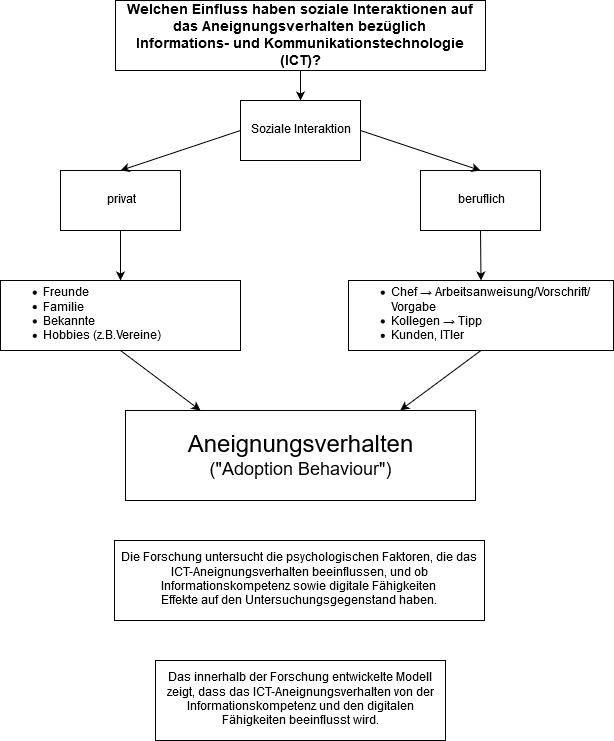

#### ICTamArbeitsplatzWS1920

### Gruppe 1: ICT am Arbeitsplatz

#### Gruppenmitglieder

* Tanita Geiger
* Andrea Wiel
* Julian Freudenhammer
* Julian Massau
* Chanrainsey Roth
* Marie Sommermann

#### Forschungsfrage

Welchen Einfluss haben soziale Interaktionen im privaten und beruflichen Kontext auf das Aneignungsverhalten bezüglich Informations- & Kommunikations-Technologie (ICT) am Arbeitsplatz?

#### Faktorenraum

#### Faktorenraum BETA

